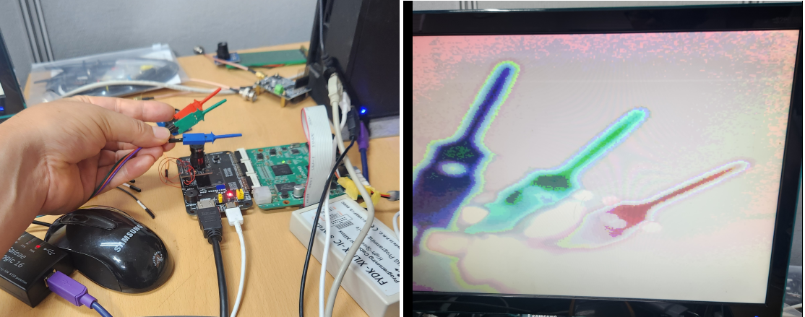
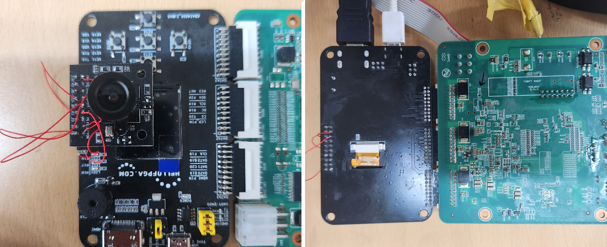

# NexEBAZ4205_OV5640_PS

EBAZ4205 + hellofpga IO board + OV5640 camera → HDMI output

> 관련 게시글: [Vivado ILA를 이용한 파형분석 / VIO를 사용한 I2C 초기화 상세 디버깅](https://nexfield.net/support/board_ref/view/365-FPGA-vivado-ILA%EB%A5%BC-%EC%9D%B4%EC%9A%A9%ED%95%9C-%ED%8C%8C%ED%98%95%EB%B6%84%EC%84%9D-VIO%EB%A5%BC-%EC%82%AC%EC%9A%A9%ED%95%9C-i2c-%EC%B4%88%EA%B8%B0%ED%99%94-%EC%83%81%EC%84%B8-%EB%94%94%EB%B2%84%EA%B9%85-)

## Status

- [x] 프로젝트 생성 (2026-05-15)
- [x] HDMI 컬러바 출력 확인 (5색: White / Yellow / Cyan / Green / Purple)
- [x] OV5640 영상 HDMI 출력 확인 (2026-06-21)

**EBAZ4205 + hellofpga.com IO + OV5640 선 연결**

- OV5640 DVP 1280x720 RGB565 → 3:1 subsample → 320x240 BRAM → 2x upscale → 640x480
- HDMI output via rgb2dvi (Digilent)
- Vivado project: `vivado -mode batch -source vivado/build.tcl`

## Pin Map

### System

| Signal   | Pin | IOSTANDARD | Description        |
|----------|-----|------------|--------------------|
| CLK      | N18 | LVCMOS33   | 50MHz PL clock     |
| UART_TX  | H17 | LVCMOS33   | UART TX (CH340)    |

### HDMI (hellofpga IO board, TMDS)

| Signal      | Pin | IOSTANDARD | Description     |
|-------------|-----|------------|-----------------|
| HDMI_CLK_P  | F19 | TMDS_33    | TMDS clock +    |
| HDMI_CLK_N  | F20 | TMDS_33    | TMDS clock -    |
| HDMI_P[0]   | D19 | TMDS_33    | TMDS data0 +    |
| HDMI_N[0]   | D20 | TMDS_33    | TMDS data0 -    |
| HDMI_P[1]   | C20 | TMDS_33    | TMDS data1 +    |
| HDMI_N[1]   | B20 | TMDS_33    | TMDS data1 -    |
| HDMI_P[2]   | B19 | TMDS_33    | TMDS data2 +    |
| HDMI_N[2]   | A20 | TMDS_33    | TMDS data2 -    |

### OV5640 (hellofpga IO board 20-pin camera connector)

## 하드웨어 점퍼 변경 내역

- PCLK: J20(non-SRCC) → J18(MRCC P-type) 점퍼
- RST: M18(트레이스 절단) → G20 점퍼, 이후 G20을 D[2]로 재활용 → **J20**으로 이동
- D[0]: M20(AD2N XADC, 1고착) → G19(구 PWDN핀) 점퍼, 카메라 PWDN=GND 직결
- D[2]: L17(SRCC stuck) → J20(XADC, 1고착) → **G20**(구 RST핀) 점퍼
- D[4]: L20(AD3N XADC, 1고착) → K18(MRCC N-type) 점퍼

> **핀 부족 문제 해결 과정**
>
> D[0], D[2], D[4]가 원래 커넥터 핀(M20, L17, L20)에서 항상 1로 고착되는 문제가 발생했다.
> M20, L20은 Zynq-7000 Bank 35의 XADC 보조 아날로그 입력 핀(VAUXN)으로,
> 아날로그 프런트엔드 회로(내부 바이어스·커패시터)가 항상 연결되어 있어
> 디지털 입력 버퍼가 정상 신호를 읽지 못하고 1로 고착된다.
>
> 핀 재배선 과정에서 D[2]를 J20(IO_L17P_T2_AD5P_35 = XADC VAUXP[5])으로 옮겼으나
> 동일한 이유로 1 고착이 재현됐다.
>
> 결국 RST 출력 핀이었던 G20을 D[2] 입력으로 재활용하고,
> RST 출력을 J20으로 옮겼다.
> **J20은 입력으로는 사용 불가하지만 출력으로는 정상 동작한다.**
> 이유: XADC 아날로그 입력 회로는 수동 소자(저항·커패시터)로만 구성되어 있어
> 입력 시에는 핀 전압을 특정 레벨로 끌어당기지만,
> 출력 시에는 PL의 OBUF 드라이버(수십 mA 구동 능력)가 그 영향을 무시하고
> 핀을 원하는 레벨로 정상 구동할 수 있기 때문이다.

| Signal          | Pin | IOSTANDARD | Description                          |
|-----------------|-----|------------|--------------------------------------|
| ov5640_pclk     | J18 | LVCMOS33   | Pixel clock (MRCC P-type, 54MHz)     |
| ov5640_vsync    | M17 | LVCMOS33   | Vertical sync                        |
| ov5640_href     | N20 | LVCMOS33   | Horizontal ref                       |
| ov5640_data[0]  | G19 | LVCMOS33   | Pixel data bit 0 (구 PWDN핀 재활용)  |
| ov5640_data[1]  | L16 | LVCMOS33   | Pixel data bit 1                     |
| ov5640_data[2]  | G20 | LVCMOS33   | Pixel data bit 2 (구 RST핀 재활용)   |
| ov5640_data[3]  | L19 | LVCMOS33   | Pixel data bit 3                     |
| ov5640_data[4]  | K18 | LVCMOS33   | Pixel data bit 4 (MRCC N-type 재활용)|
| ov5640_data[5]  | J19 | LVCMOS33   | Pixel data bit 5                     |
| ov5640_data[6]  | K19 | LVCMOS33   | Pixel data bit 6                     |
| ov5640_data[7]  | H20 | LVCMOS33   | Pixel data bit 7                     |
| ov5640_sioc     | P18 | LVCMOS33   | I2C SCL                              |
| ov5640_siod     | M19 | LVCMOS33   | I2C SDA                              |
| ov5640_reset    | J20 | LVCMOS33   | Reset (active low, XADC출력으로 동작)|
| ov5640_pwdn     | L17 | LVCMOS33   | Power down — dummy (카메라 GND 직결) |

## 참고 게시글

- [Vivado ILA를 이용한 파형분석 / VIO를 사용한 I2C 초기화 상세 디버깅](https://nexfield.net/support/board_ref/view/365-FPGA-vivado-ILA%EB%A5%BC-%EC%9D%B4%EC%9A%A9%ED%95%9C-%ED%8C%8C%ED%98%95%EB%B6%84%EC%84%9D-VIO%EB%A5%BC-%EC%82%AC%EC%9A%A9%ED%95%9C-i2c-%EC%B4%88%EA%B8%B0%ED%99%94-%EC%83%81%EC%84%B8-%EB%94%94%EB%B2%84%EA%B9%85-)
